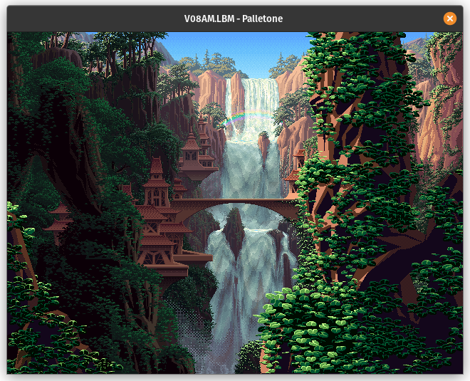

# palletone
Display LBM images with support for animated color ranges in the palette

  
*art by [Mark Ferrari](http://www.markferrari.com/)*

## Requirements
`sfml` library
## Compilation
Run `make`
## Usage
`./bin/palletone [FILE]`
## Notes
A selection of artworks that can be used with this program has been archived by Werner & Walter Randelshofer on their [website](http://www.randelshofer.ch/animations/anims_ibm/mark_j_ferrari/thu_mark_j_ferrari.html)

Only PBM encoded images are supported
